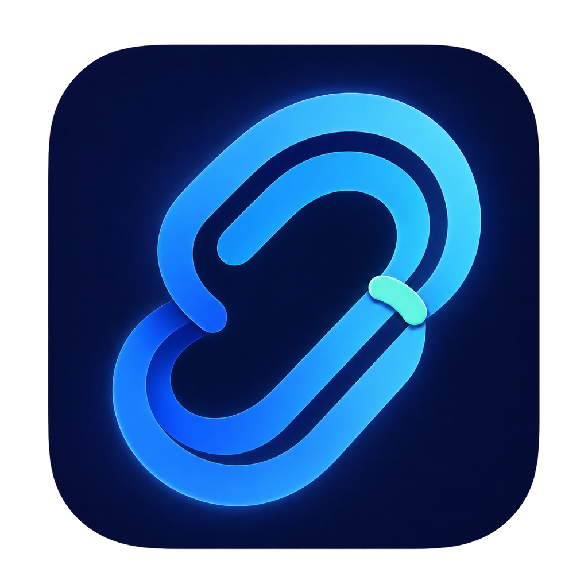

# SideRefresh — 개인용 iOS 앱 자동 갱신



[English](README.md) | [한국어](README.ko.md)

**에이전트나 Xcode로 만든 내 iOS 앱을 만료 전에 다시 설치합니다.**

SideRefresh는 무료 Xcode Personal Team으로 설치한 개인용 앱을 현재 Mac의
소스에서 다시 빌드·서명하고, 선택한 iPhone에 재설치하는 오픈소스 macOS
앱입니다. Claude Code, Codex, Cursor 같은 코딩 에이전트가 만든 Xcode
프로젝트도 같은 방식으로 사용할 수 있습니다.

SideRefresh는 앱스토어, IPA 카탈로그, 서명 서비스나 Apple 보안 우회 도구가
아닙니다. 본인이 소유한 프로젝트와 Apple의 Xcode 개발 서명 경로를
사용합니다.

## 하는 일

- Xcode 앱 한 개와 페어링된 iPhone 한 대를 선택합니다.
- Xcode로 빌드·서명하고 Bundle ID를 확인한 뒤 설치합니다.
- 현재 버전을 유지하거나 갱신 시 다음 버전으로 올립니다.
- 실제 설치와 서명 만료 증거가 확인된 성공만 기록합니다.
- 짧게 실행되는 백그라운드 Agent가 만료 전에 갱신을 확인합니다.
- Simple 홈, 최초 설정과 앱·iPhone 선택 화면을 영어 또는 한국어로
  표시합니다. 기본값은 macOS 앱 언어이며 **설정 → 언어**에서 시스템 설정,
  한국어, English 중 하나를 선택할 수 있습니다.

## 필요한 것

- macOS 13 이상을 실행하는 Mac
- Xcode와 Apple Account
- Xcode에 표시되는 무료 Personal Team
- Developer Mode, Mac 신뢰, Xcode 페어링을 완료한 실제 iPhone
- 본인이 빌드할 수 있는 `.xcworkspace` 또는 `.xcodeproj`

개인 iPhone에서 쓰는 앱에는 유료 Apple Developer Program 가입이 필요하지
않습니다. 다만 Xcode 로그인과 무료 Personal Team은 필요하며, Personal Team
서명은 영구적이지 않습니다.

## 처음 설정

1. Xcode에서 Apple Account와 Personal Team을 준비하고, iPhone을 페어링한
   뒤 해당 앱을 iPhone에서 한 번 실행합니다.
2. SideRefresh의 **설정**에서 **앱 선택**을 누릅니다. 한 개의 프로젝트나
   워크스페이스를 고르고 앱 이름, Bundle ID, 버전, Scheme, Personal Team을
   확인한 뒤 창 아래 고정 영역에서 선택을 확정합니다.
3. **iPhone 선택**을 누르고 Xcode에 페어링된 iPhone 한 대를 고른 뒤
   확정합니다.
4. 일반적인 USB 또는 Xcode 네트워크 연결에는 **추가 주소 없음**을
   유지합니다. **Tailscale · 실험적**은 선택 기능이며 Mac과 iPhone 모두에
   Tailscale이 필요합니다.
5. 갱신 간격과 버전 방식을 확인하고 창 아래의 **설정 저장**을 누릅니다.
   저장할 수 없으면 같은 영역에 먼저 해야 할 작업이 표시됩니다.
6. **내 앱**으로 돌아가 **지금 갱신**을 한 번 실행하고 빌드, 서명, 설치,
   만료일 기록을 확인합니다.
7. 첫 설치가 확인된 뒤 **자동 갱신**을 명시적으로 켭니다.

자세한 화면 흐름은 [한국어 사용 설명서](docs/MANUAL.ko.md)를 참고하세요.

## 연결 방식의 의미

실제 설치 대상은 항상 Xcode/CoreDevice의 iPhone UDID로 결정됩니다.

- **추가 주소 없음:** USB 또는 Xcode가 이미 사용할 수 있는 네트워크 경로
- **Tailscale · 실험적:** Tailnet의 iPhone 주소와 온라인 상태를 추가 확인
- **직접 IP/DNS:** 고급 문제 해결용 주소

Tailscale에서 온라인이라고 Xcode 연결까지 확인된 것은 아닙니다. 화면의
**Xcode에서 iPhone 확인**을 별도로 실행해야 하며, 초기 페어링·신뢰·Developer
Mode를 Tailscale이 대신하지 않습니다. 순수 셀룰러 Tailnet 경로의 실제
CoreDevice 설치는 아직 공개 지원 범위로 검증되지 않았습니다.

## 현재 공개 범위

- 설정 한 개당 내 앱 1개와 iPhone 1대
- Mac, Xcode, Apple Account Personal Team이 있는 사용자
- 본인이 소유한 Xcode 프로젝트의 소스 빌드와 재설치
- USB 실제 기기 및 Flutter/CocoaPods 워크스페이스 검증

첫 릴리스에는 타인의 IPA 설치, 여러 앱·여러 iPhone 동시 관리, Xcode 없는
사용자, 팀 단위 장비 관리를 포함하지 않습니다.

## 소스에서 실행

```sh
swift test
Scripts/validate-samples.sh
Scripts/build-app.sh
open dist/SideRefresh.app
```

기본 빌드는 로컬 개발용 ad-hoc 서명입니다. 다운로드 가능한 공개 Mac 앱은
Developer ID 서명과 Apple 공증을 별도 통과해야 합니다. 현재 배포 상태는
[배포 문서](docs/DISTRIBUTION.md)를 참고하세요.

이 공개 저장소는 개인정보를 제거한 단일 스냅샷으로 만들었으며 비공개 개발
이력은 복사하지 않았습니다. 홈페이지 소스는 영어, 한국어, 일본어,
중국어(간체)로 포함되어 있지만, 서명·공증된 다운로드가 준비될 때까지 GitHub
Pages는 비활성화합니다. 홈페이지 설명 언어와 별개로 현재 앱 인터페이스는
영어와 한국어를 지원합니다.

## 문서

| 문서 | 내용 |
| --- | --- |
| [사용 설명서](docs/MANUAL.ko.md) | 최초 설정, 연결, 저장, 갱신 |
| [Personal Team 준비](docs/PERSONAL-TEAM-SETUP.ko.md) | Xcode 로그인·서명 문제 해결 |
| [구현 상태](docs/STATUS.md) | 검증 범위와 제한 |
| [Product Hunt 공식 조사·전략](docs/product-hunt/research.md) · [실행 문서](docs/product-hunt/README.md) · [한국어 문구](docs/PRODUCT-HUNT.ko.md) | 등록, 홍보 운영, 소개 문구, 이미지와 출시 게이트 |
| [공개 홈페이지 — English](docs/index.html) · [한국어](docs/ko/index.html) · [日本語](docs/ja/index.html) · [简体中文](docs/zh-cn/index.html) | 네 언어 제품 설명과 공개 전 검증 |
| [iOS 갱신 도구](docs/IOS-RENEWAL.md) | 빌드·버전 정책 |
| [배포](docs/DISTRIBUTION.md) | 소스 빌드와 공증 릴리스 경로 |

기여는 [CONTRIBUTING.md](CONTRIBUTING.md), 보안 제보는
[SECURITY.md](SECURITY.md)를 따라 주세요.

## 라이선스

MIT. [LICENSE](LICENSE)를 참고하세요.
