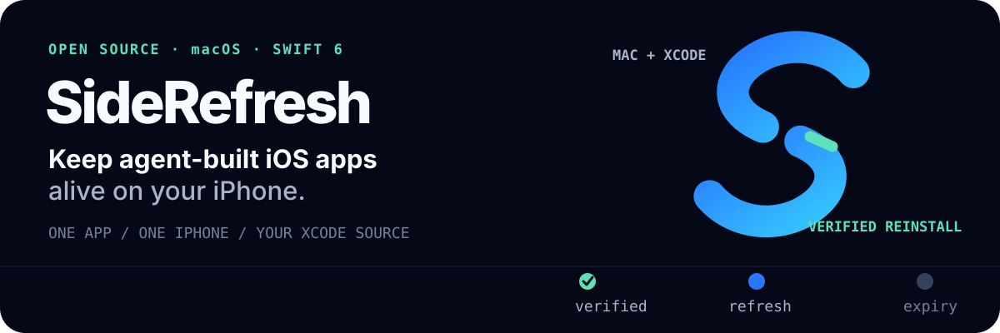
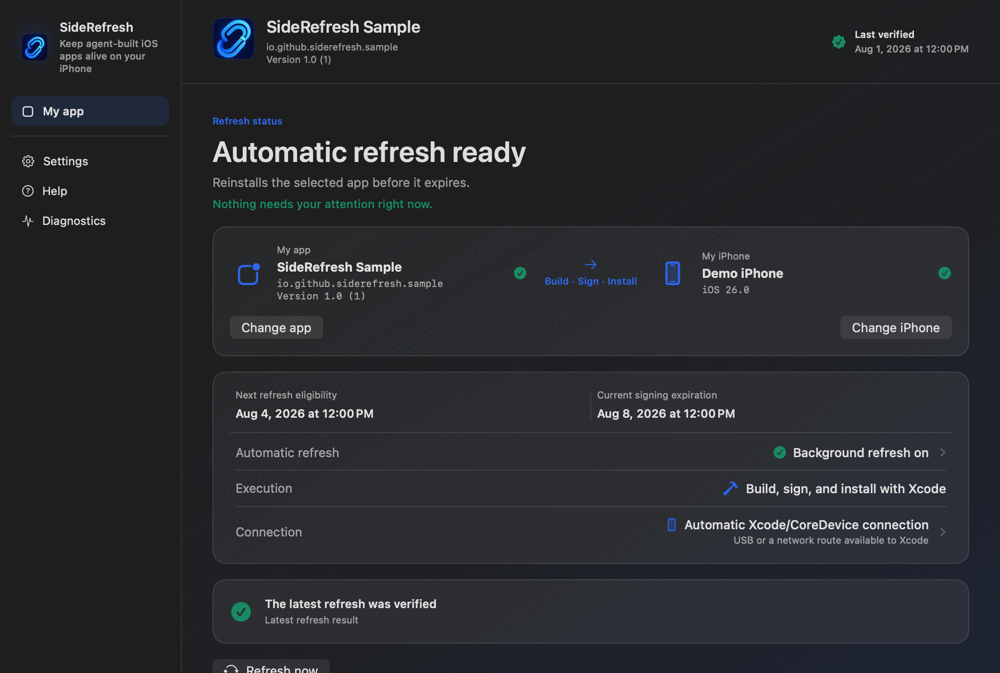

<p align="center">
  
</p>

<p align="center">
  <a href="https://recrack.github.io/SideRefresh/">Website</a> ·
  <a href="README.ko.md">한국어</a> ·
  <a href="docs/MANUAL.md">Manual</a> ·
  <a href="https://github.com/recrack/SideRefresh/releases">Release status</a>
</p>

SideRefresh is an open-source macOS app that rebuilds, signs, and reinstalls
one iOS app you own before free Xcode Personal Team signing expires. It uses
the source and Apple tooling already on your Mac—no IPA catalog, signing
service, jailbreak, or Apple Account password collection.

> Source builds are available now. A Developer ID-signed and notarized public
> Mac build remains a separate release gate.

Current source prerelease:
[v0.2.0-beta.2](https://github.com/recrack/SideRefresh/releases/tag/v0.2.0-beta.2).

## See the product



<sub>Sample preview · synthetic data. The app interface currently supports English and Korean.</sub>

The Simple workspace keeps one relationship visible: your app → build, sign,
install → your iPhone. Raw Xcode and CoreDevice output stays in Diagnostics.

## One verified refresh, then automatic renewal

1. **Prepare Xcode once.** Sign in with an Apple Account, choose your free
   Personal Team, pair the iPhone, enable Developer Mode, and run your app once.
2. **Choose one app and one iPhone.** SideRefresh reviews the app name, Bundle
   ID, version, scheme, team, and CoreDevice identity before saving.
3. **Run Refresh now.** It builds with Xcode, validates the Bundle ID, installs
   through CoreDevice, and records success only with expiration evidence.

After that first verified installation, explicitly enable **Automatic refresh**.
The Mac must be awake and the iPhone reachable when a renewal is due.

## Start from source

**Requirements:** macOS 13+, Xcode 16.2 or a compatible Swift 6 toolchain, an
Apple Account Personal Team, and one paired physical iPhone.

```sh
swift test
Scripts/validate-samples.sh
Scripts/build-app.sh
open dist/SideRefresh.app
```

The default build uses an ad-hoc signature for local development. It does not
register the background Agent or modify Login Items.

## What happens on your Mac

```text
launchd → short-lived Agent → renewal engine → xcodebuild → devicectl → iPhone
                              ↘ optional Tailnet preflight
```

- Current Xcode source is rebuilt; SideRefresh does not pull Git changes.
- Build settings resolve the exact app product before Bundle ID validation.
- Version behavior—keep or advance—is separate from the build strategy.
- Native workspace, CLI, LaunchAgent, and MCP surfaces share the same core.

## Deliberately narrow

SideRefresh currently supports one app you own, one Xcode project or workspace,
and one paired iPhone per configuration. It does **not** install third-party
IPAs, make Personal Team signing permanent, manage fleets, work without Xcode,
or claim verified pure-cellular CoreDevice renewal. Tailscale remains optional
and experimental; it does not replace Apple pairing, trust, or signing.

## Go deeper

- **Set up:** [User manual](docs/MANUAL.md) · [Personal Team](docs/PERSONAL-TEAM-SETUP.md)
- **Understand:** [Implementation status](docs/STATUS.md) · [Architecture](docs/side-refresh-architecture.html)
- **Automate:** [CLI, LaunchAgent, and MCP](docs/HEADLESS.md) · [Renewal helper](docs/IOS-RENEWAL.md)
- **Build:** [Examples](Examples/README.md) · [Distribution](docs/DISTRIBUTION.md)
- **Evaluate:** [Open-source landscape](docs/research/open-source-viability-and-landscape.md) · [Product Hunt plan](docs/product-hunt/README.md)

## Contributing and license

Install the repository hooks with `Scripts/install-git-hooks.sh`, then see
[CONTRIBUTING.md](CONTRIBUTING.md). Report sensitive issues through
[SECURITY.md](SECURITY.md). Code and documentation are available under the
[Apache License 2.0](LICENSE); names and visual assets follow the
[brand policy](BRAND_POLICY.md). Versions through `v0.2.0-beta.1` remain MIT-licensed.
